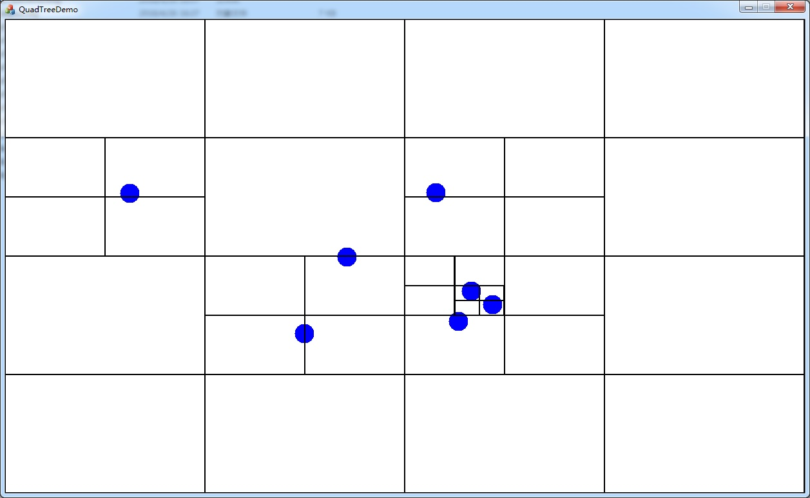

# QuadTreeDemo

*(仅供学习参考用)*

QuadTreeDemo 包含以下内容：
  - `HEAD ONLY`的四叉树算法实现
  - MFC图形化测试工具。

## 算法代码

-   [quad_tree.hpp](quad_tree.hpp)
-   [rect.hpp](rect.hpp)
-   [vec2.hpp](vec2.hpp)

## 测试界面

## 代码贡献者

-   网友：黯然寒月光
-   QQ群：296561497
